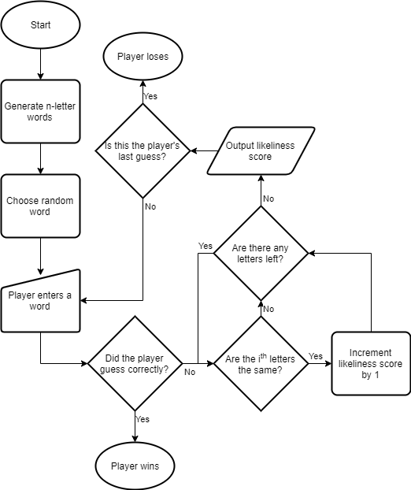

# COMP110 Worksheet 3: Flowcharts and pseudocode

This is the base repository for COMP110 Worksheet 3.

The flowchart for the flow of the game is in this repository. Here is the flowchart for the flow of the game:


Below is the psudeocode for solving the terminal hacking minigame:

```
FUNCTION terminal():
	
	WORD_LIST = list of randomly generated, n-letter words
	
	RANDOM_WORD = select a random word from WORD_LIST
	
	GUESSES = 3
	
	PLAYER_WORD = random word from WORD_LIST
	
	WHILE GUESSES > 0:
				
		IF PLAYER_WORD = RANDOM_WORD:
			player wins
			
		ELSE:
			GUESSES = GUESSES - 1
			
			LIKELINESS = number of letters that are equal in position
					to both PLAYER_WORD and RANDOM_WORD
					
				IF LIKELINESS > 0:
					SIMILAR_WORDS = list of words that have letter that are also
						equal in position to both PLAYER_WORD and RANDOM_WORD
						
					PLAYER_WORD = random word from SIMILAR_WORDS
				
				ELSE:
					PLAYER_WORD = random word from WORD_LIST
					
	player loses
    
END FUNCTION

```
